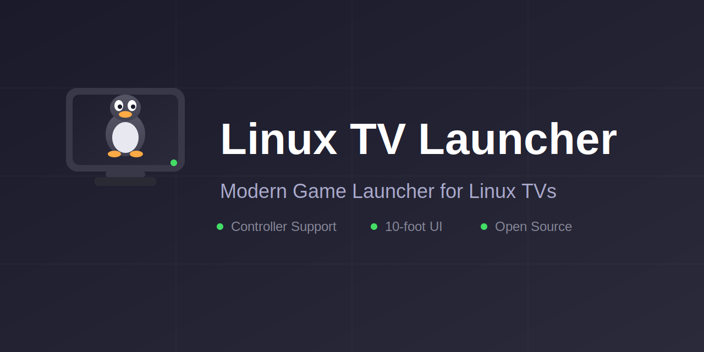

<p align="center">
  
</p>

<p align="center">
  <a href="https://github.com/RouHim/linux-tv-launcher/actions/workflows/ci.yml"></a>
  <a href="https://github.com/RouHim/linux-tv-launcher/releases/latest"></a>
  <a href="LICENSE"></a>
  
  
</p>

<p align="center">
  <strong>A fullscreen, couch-friendly launcher for Linux built with Rust and Iced.</strong><br>
  Prioritizes gamepad navigation, scans popular game libraries, and provides system tools tailored for living-room setups.
</p>

---

## Features

- **Game discovery** from Steam libraries and Heroic (Epic, GOG, Amazon, sideloaded).
- **App picker** for XDG `.desktop` apps (including Flatpak and Snap exports).
- **Cover art pipeline** with Heroic art, SteamGridDB (optional API key), and SearXNG fallback.
- **Gamepad-first navigation** with keyboard shortcuts, haptics, and battery indicators.
- **System category** for updates, system info, suspend/shutdown, and exiting the launcher.
- **On-screen keyboard integration** for GNOME, KDE, wvkbd, and Squeekboard.
- **Self-updater** that checks GitHub releases on startup.

## Installation

### Download Pre-built Binaries

Download the latest release for your architecture from [GitHub Releases](https://github.com/RouHim/linux-tv-launcher/releases/latest):

| Architecture | Binary |
|--------------|--------|
| x86_64 | `linux-tv-launcher-x86_64-unknown-linux-gnu` |
| ARM64 | `linux-tv-launcher-aarch64-unknown-linux-gnu` |

```bash
# Example: Download and run (x86_64)
chmod +x linux-tv-launcher-x86_64-unknown-linux-gnu
./linux-tv-launcher-x86_64-unknown-linux-gnu
```

### From Source

1. Install the Rust toolchain.
2. Clone the repository:
   ```bash
   git clone https://github.com/RouHim/linux-tv-launcher.git
   cd linux-tv-launcher
   ```
3. Build and run:
   ```bash
   cargo build --release
   ./target/release/linux-tv-launcher
   ```

## Runtime Notes

- **Steam games** require the `steam` client in your `PATH`.
- **Heroic games** launch via the `heroic://` protocol.
- **System updates** currently support Arch-based tools: `pacman`, `yay`, or `paru` (with `pkexec`).
- **System info** uses common utilities such as `lspci`, `glxinfo`, `vulkaninfo`, and `gamemoded` when available.
- **On-screen keyboard** support is detected automatically (GNOME, KDE, wvkbd, Squeekboard).

## Usage

### Categories

- **Games**: automatically scanned from Steam and Heroic.
- **Apps**: curated list of desktop apps you add via the picker.
- **System**: update, system info, suspend, shutdown, exit.

### Controls

**Gamepad**
- **A / South**: Select
- **B / East**: Back
- **X / West**: Context menu
- **Y / North**: Add app (Apps category)
- **D-pad / Left Stick**: Navigate
- **LB / LT**: Previous category
- **RB / RT**: Next category
- **Select / -**: Show controls

**Keyboard**
- **Arrow Keys**: Navigate
- **Enter**: Select
- **Escape**: Back
- **Tab**: Next category
- **C**: Context menu
- **+ / A**: Add app (Apps category)
- **-**: Show controls
- **F4**: Quit launcher

## Configuration

Configuration is stored at:

- `~/.config/com/linux-tv-launcher/linux-tv-launcher/config.json` (respects `XDG_CONFIG_HOME`)

Supported settings:

- `steamgriddb_api_key`: API key for SteamGridDB. You can also set `STEAMGRIDDB_API_KEY` as an environment variable.
- `apps`: saved app entries from the picker.
- `game_launch_history`: launch timestamps used for sorting.
